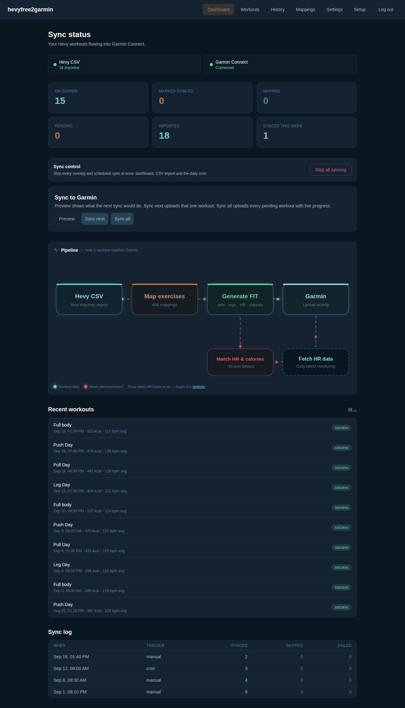
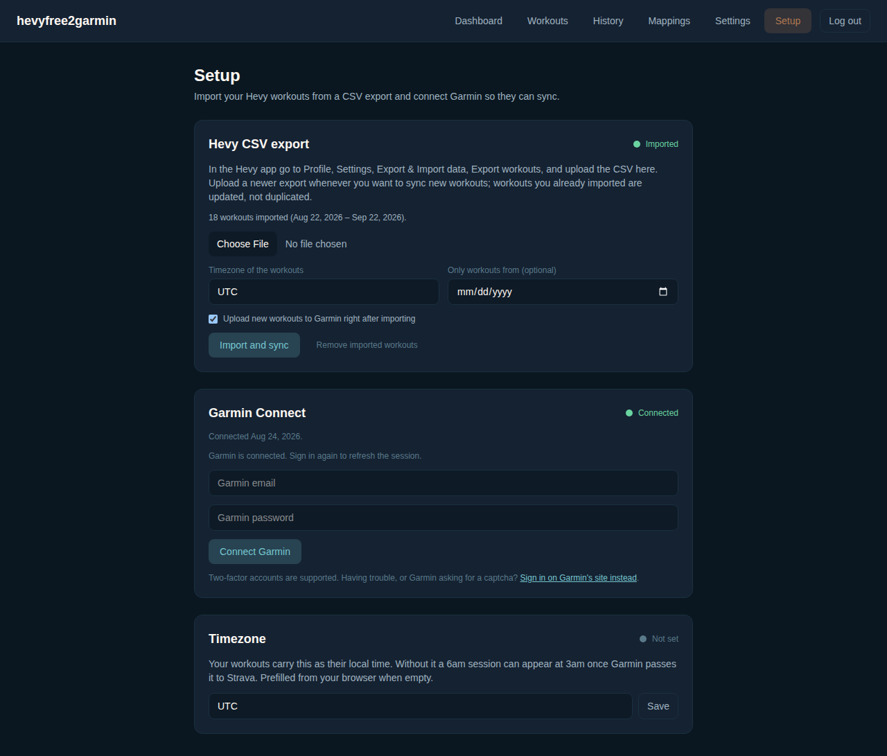
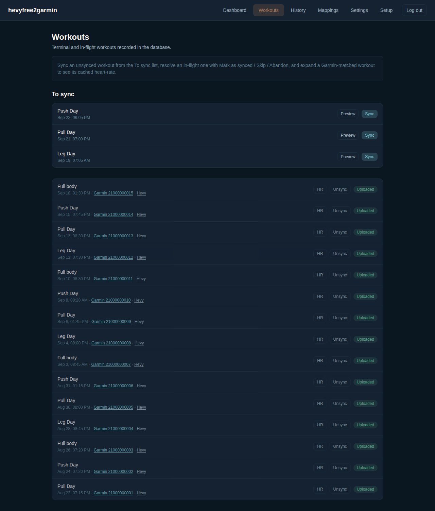
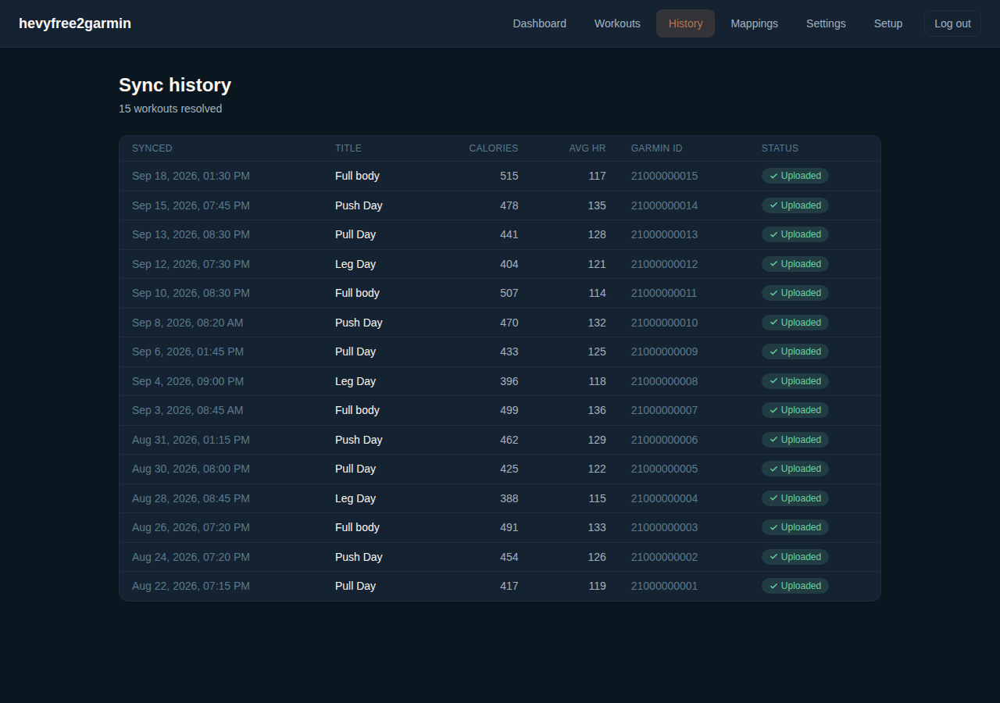
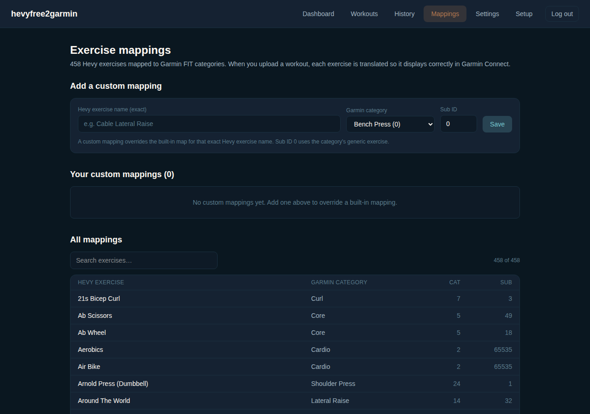
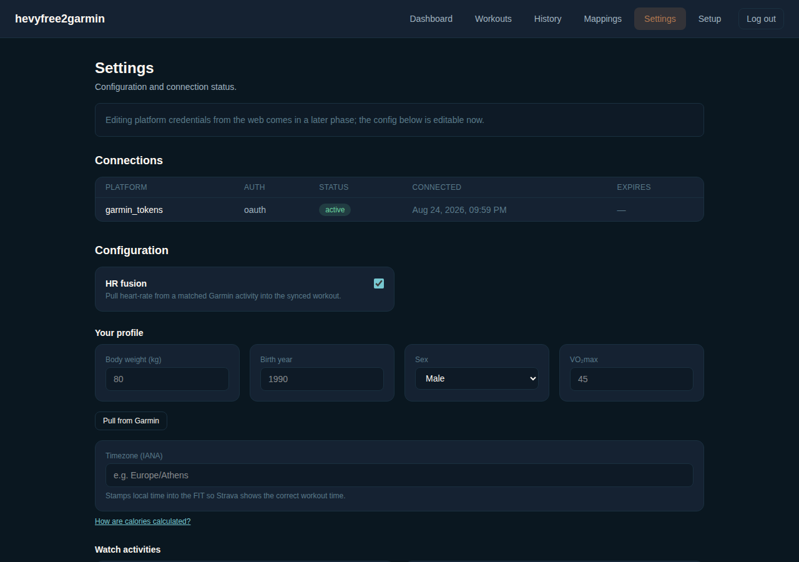
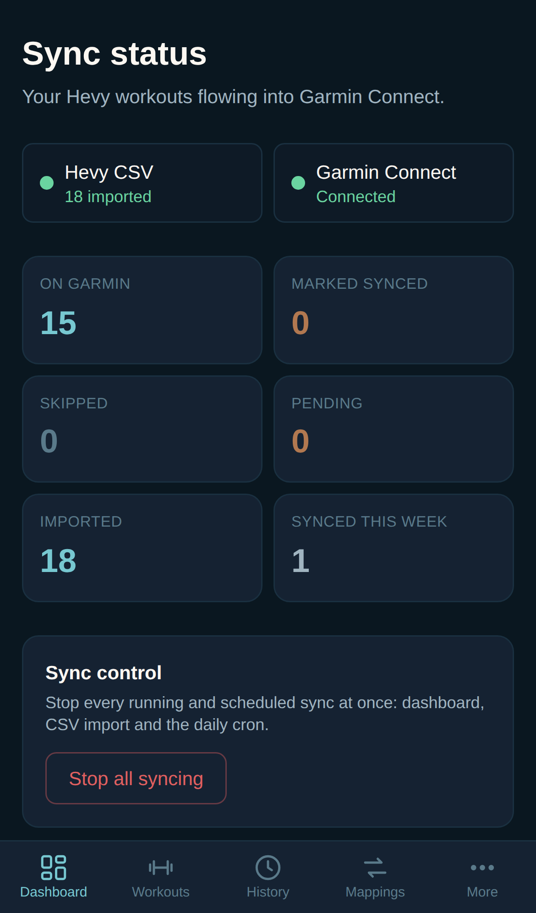
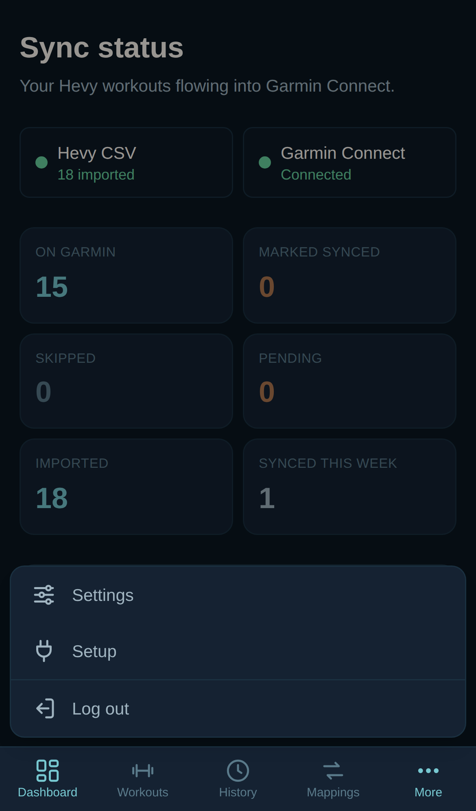
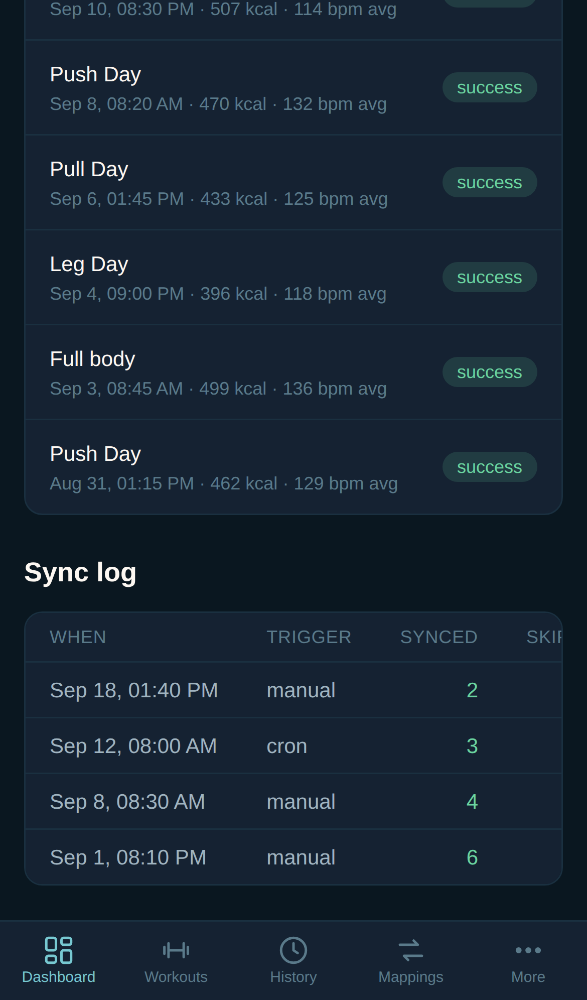

<p align="center">
  
</p>

<h1 align="center">hevyfree2garmin</h1>

<p align="center">
  Sync your <a href="https://hevyapp.com">Hevy</a> gym workouts to <a href="https://connect.garmin.com">Garmin Connect</a> from a Hevy CSV export. No Hevy Pro and no API key needed. Garmin gets the right exercise names, sets, reps, weights, a calorie estimate and, optionally, heart rate from your watch.
</p>

<p align="center">
  <a href="https://vercel.com/new/clone?repository-url=https%3A%2F%2Fgithub.com%2Fdkortekaas%2Fhevyfree2garmin&root-directory=web&project-name=hevyfree2garmin&repository-name=hevyfree2garmin&env=H2G_PASSWORD,HEVY2GARMIN_SECRET,CRON_SECRET&envDescription=Dashboard%20password%2C%20a%20cookie%20signing%20secret%20and%20a%20cron%20secret%20%2832%20random%20characters%20each%20for%20the%20secrets%29&envLink=https%3A%2F%2Fgithub.com%2Fdkortekaas%2Fhevyfree2garmin%23environment-variables"></a>
</p>

<p align="center">
  
</p>

> **Based on hevy2garmin.** This project is a fork of [hevy2garmin](https://github.com/drkostas/hevy2garmin) by Konstantinos Georgiou, released under the MIT license (see [LICENSE](LICENSE)). The exercise mapping, FIT generation, Garmin upload and duplicate protection all come from that project. This fork removes everything that uses the Hevy API (API key, webhook, routines, GitHub Actions auto-sync, the Python CLI) and keeps one workout source: the CSV export every Hevy account can download.

## How it works

1. **Export from Hevy.** In the Hevy app: Profile → Settings → Export & Import Data → Export Workouts. You get a CSV file.
2. **Upload it on the Setup page.** The app turns each workout in the file into a structured workout and stores it in your database.
3. **Sync to Garmin.** Each workout's exercises are mapped to Garmin's FIT exercise categories (450+ built-in mappings, plus your own). A FIT file with timing, sets, reps, weights and calories is generated and uploaded to Garmin Connect, where it gets a name and a description. With **HR fusion** on, heart rate from your Garmin watch is added.
4. **Next time**, export again and upload the new file. Workouts you already imported are updated, not added twice. Workouts that are already on Garmin are never uploaded again.

Nothing goes to Garmin without you asking for it. A sync starts only from one of these:
- the import's **Upload to Garmin right after importing** box
- the dashboard's **Sync next** or **Sync all**
- the daily cron, which picks up anything left pending

## Screenshots

| Dashboard | Setup |
|---|---|
|  |  |
| **Workouts** | **History** |
|  |  |
| **Mappings** | **Settings** |
|  |  |

On a phone the bottom bar has four tabs plus **More**, and wide tables scroll sideways:

<p>
  
  
  
</p>

## Deploy on Vercel

About ten minutes, no coding.

[](https://vercel.com/new/clone?repository-url=https%3A%2F%2Fgithub.com%2Fdkortekaas%2Fhevyfree2garmin&root-directory=web&project-name=hevyfree2garmin&repository-name=hevyfree2garmin&env=H2G_PASSWORD,HEVY2GARMIN_SECRET,CRON_SECRET&envDescription=Dashboard%20password%2C%20a%20cookie%20signing%20secret%20and%20a%20cron%20secret%20%2832%20random%20characters%20each%20for%20the%20secrets%29&envLink=https%3A%2F%2Fgithub.com%2Fdkortekaas%2Fhevyfree2garmin%23environment-variables)

### With the button

1. Click **Deploy with Vercel** above and sign in with GitHub. Vercel copies this repo into your GitHub account and sets **Root Directory** to `web`.
2. Fill in the three environment variables it asks for:
   - `H2G_PASSWORD`: the password for your dashboard.
   - `HEVY2GARMIN_SECRET`: 32 random characters that sign the login cookie.
   - `CRON_SECRET`: 32 random characters. Vercel's daily cron sends it to `/api/cron/sync`.
3. After the first deploy, open the project's **Storage** tab, add **Neon Postgres** (free) and **Redeploy**. Without a database the app shows an "internal server error".
4. Open the URL, sign in and continue on the **Setup page** (step 6 below).

The button makes a copy, not a fork. A copy does not show GitHub's **Sync fork** button, so to get updates later you pull them in yourself. If you want that button, use the manual route below.

### By hand

1. **Fork this repo** on GitHub.
2. **Import it on Vercel.** Go to [vercel.com/new](https://vercel.com/new), pick your fork and set **Root Directory** to `web`.
3. **Add a database.** Add **Neon Postgres** (free) under **Storage**, during the import or right after the first deploy. Vercel sets `POSTGRES_URL` for you. The app creates its tables on first use.
4. **Set environment variables** (Settings → Environment Variables):
   - `H2G_PASSWORD`: the password for your dashboard. Without it the app serves only a page telling you to set one.
   - `HEVY2GARMIN_SECRET`: 32 random characters that sign the login cookie.
   - `CRON_SECRET`: 32 random characters. Vercel's daily cron sends it to `/api/cron/sync`.
5. **Deploy**, open the URL and sign in.
6. **Setup page:**
   - **Garmin Connect:** enter your Garmin email and password. With 2FA, a code field appears for the code Garmin emails you.
   - **Hevy CSV export:** choose the exported file, check the timezone (Hevy writes times without an offset), and click **Import and sync**.
   - **Timezone:** set it once so Garmin and Strava show your local time.

> **EU users:** if you see an upload consent error, open [Garmin Connect settings](https://connect.garmin.com/modern/settings), go to **Data** and enable **Device Upload**. Garmin asks for this once.

## Using it

### Import

**Setup → Hevy CSV export.**
- **Timezone of the workouts:** the zone your workouts happened in. It defaults to the timezone you saved, otherwise your browser's.
- **Only workouts from:** skip older workouts, for example ones that already reached Garmin another way.
- **Upload new workouts to Garmin right after importing:** on by default. Ticked, the import runs **Sync all** straight away with a progress bar and a Stop button. Unticked, the workouts wait in the **To sync** list on the Workouts page.
- **Remove imported workouts:** clears the import. Workouts that were already synced stay on Garmin and stay marked as synced.

Very large exports can go over Vercel's 4.5 MB upload limit. Use **Only workouts from** with a recent export to upload in parts.

### Sync

The dashboard's **Sync to Garmin** card:

- **Preview** shows what the next sync would do (which workout, and whether it would upload a new activity or match one already on Garmin). Nothing is written.
- **Sync next** uploads that one workout, after you confirm.
- **Sync all** uploads every pending workout, one at a time, with live progress and a Stop button. It runs on the server, so you can close the page or lock your phone. Open the dashboard again to see how far it got.

Each workout can also be synced on its own from the **Workouts** page.

**How Sync all keeps running.** The server syncs for about 30 seconds at a time, which stays inside Vercel's time limit per request. After each block it calls `/api/cron/sync-background` to start the next one, authenticated with `CRON_SECRET`. Without `CRON_SECRET`, a run pauses after its first block and continues whenever the dashboard is open.

On Vercel, a cron job runs once a day and syncs anything still pending. It calls `GET /api/cron/sync` with `Authorization: Bearer <CRON_SECRET>`. It waits two hours after a workout ends, so a watch recording can reach Garmin first and be merged instead of duplicated. The buttons on the dashboard do not wait.

### Stop all syncing

**Stop all syncing** on the dashboard sets one switch that every upload path checks: the dashboard buttons, the sync after an import, and the cron. A sync that is running finishes the workout it is on and then stops. **Resume syncing** lifts the switch. Previews keep working while syncing is stopped.

### Mappings

The export has no Hevy exercise ids, so exercises are matched by name. Unmapped exercises show up on the **Mappings** page, where you can pick the Garmin category in a few clicks. If Hevy is set to a language other than English, more exercises may need a mapping.

### Enhance watch activities (opt-in)

If you record a **Strength Training** activity on your Garmin watch while you train, turn on **Settings → Enhance watch activities**. The sync then finds the matching watch activity and combines it with your Hevy sets. To match, the watch activity must overlap the Hevy workout by 70% and start within 20 minutes of it.

The **Merge watch strategy** setting decides how they are combined:
- **Merge** folds your sets and reps into the watch activity.
- **Describe** only writes the notes.
- **Replace** uploads one new named activity with the watch's 1-second heart rate, then removes the watch copy.

To also match other watch activity types (for example `bouldering, indoor_climbing`), add them under **Advanced**.

### Activity description

Every synced activity gets a summary in its description:

```
🏋️ Push Day
⏱️ 52 min
🔥 387 kcal
❤️ avg 118 bpm

• Bench Press (Barbell): 3 sets · 80.0kg × 8
• Incline Dumbbell Press: 3 sets · 28.0kg × 10

— synced by hevy2garmin
```

### Deleting all workouts

**Settings → Danger zone → Delete all workouts** removes every workout record the app holds: the sync history, in-flight uploads, the CSV import and cached heart rate. Nothing on Garmin is touched.

It also turns on **Stop all syncing** and leaves it on. With the history gone, re-importing the same file would upload everything a second time, so you have to resume syncing yourself.

## Self-hosting

The app is a plain Next.js app in `web/` and runs anywhere Node 22 runs:

```bash
git clone https://github.com/<you>/hevyfree2garmin.git
cd hevyfree2garmin/web
cp .env.example .env.local   # DATABASE_URL, H2G_PASSWORD, HEVY2GARMIN_SECRET, CRON_SECRET
npm ci && npm run build && npm start   # http://localhost:8096
```

`DATABASE_URL` can point at any Postgres. Put the app behind a reverse proxy with TLS. For the daily catch-up, call the cron route from your own scheduler.

To keep the plain password out of the environment, store a hash instead:

```bash
npm run hash-password -- 'your password'   # prints $argon2id$…
```

Put the output in `H2G_PASSWORD_HASH` and leave out `H2G_PASSWORD`.

### Garmin login

Garmin blocks logins from cloud servers, so the Setup page signs in through a Cloudflare Worker. The worker passes the login on to Garmin and returns the Garmin tokens, which are stored in your own database.

**These are the workers the original hevy2garmin project runs** (on `gkos.workers.dev`). Set `GARMIN_LOGIN_WORKER_URL` to use your own worker for the direct login. The fallback flow (sign in on Garmin's site and paste the result back) still uses the original project's exchange worker.

### intervals.icu (optional)

With the **Replace** strategy, Garmin ends up with one activity, but intervals.icu keeps the copy it already pulled. Set `INTERVALS_API_KEY` and `INTERVALS_ATHLETE_ID` and that copy is deleted too. A failure there never fails a sync.

## Environment variables

| Variable | Required | What it does |
|---|---|---|
| `DATABASE_URL` (or `POSTGRES_URL`) | yes | Postgres connection string |
| `H2G_PASSWORD` or `H2G_PASSWORD_HASH` | yes | Dashboard password (plain, or argon2 from `npm run hash-password`) |
| `HEVY2GARMIN_SECRET` | yes | Signs the session cookie |
| `CRON_SECRET` | for the cron | Bearer token for `/api/cron/sync` |
| `GARMIN_LOGIN_WORKER_URL` | no | Your own Garmin login worker |
| `INTERVALS_API_KEY`, `INTERVALS_ATHLETE_ID` | no | Remove replaced activities from intervals.icu |
| `DEMO_MODE` | no | `true` makes the dashboard read-only |

## FAQ

**Is the sync one-way?**
Yes. Hevy goes to Garmin; nothing flows back to Hevy.

**Does it sync new workouts on its own?**
Only workouts you have imported. The CSV export is the only way workouts get in, so after training you export again and upload the new file. With **Upload to Garmin right after importing** ticked, that one upload is all it takes.

**Can I switch from hevy2garmin?**
Yes. Point this app at the same database. The sync history, Garmin tokens, mappings and settings carry over. The hevy2garmin routine tables stay in the database but are not used. CSV imports continue where they left off.

**Every workout appears twice on Strava.**
Hevy and Garmin are both connected to Strava. Turn off Hevy → Strava. The copy that arrives through Garmin has the heart rate and the exercise names.

**The activity shows the wrong time on Strava.**
Set your **Timezone** on the Setup page. The local time is then stamped into the uploaded file.

**Why does Garmin show different calories?**
When the upload carries heart rate, Garmin ignores the calorie estimate in the file and recomputes calories with its own model and your Garmin profile.

**Why no Training Effect or recovery time?**
Garmin computes those only for activities its own devices recorded. To keep them, record the session on your watch and use [Enhance watch activities](#enhance-watch-activities-opt-in) with **Merge** or **Describe**.

## Development

```bash
cd web
npm ci
npm run dev            # http://localhost:8096
npm test               # unit tests (vitest), including the sync engine in web/engine
npm run lint
npx tsc --noEmit
npm run e2e            # Playwright smoke test, desktop and mobile
```

The sync engine (FIT generation, exercise mapping, Garmin gateway, dedup) lives in `web/engine`. It is the TypeScript package from hevy2garmin 0.9.0 with the Hevy API client removed.

## License

MIT. See [LICENSE](LICENSE). The original copyright of Konstantinos Georgiou (hevy2garmin) applies to the code this fork is built on.
